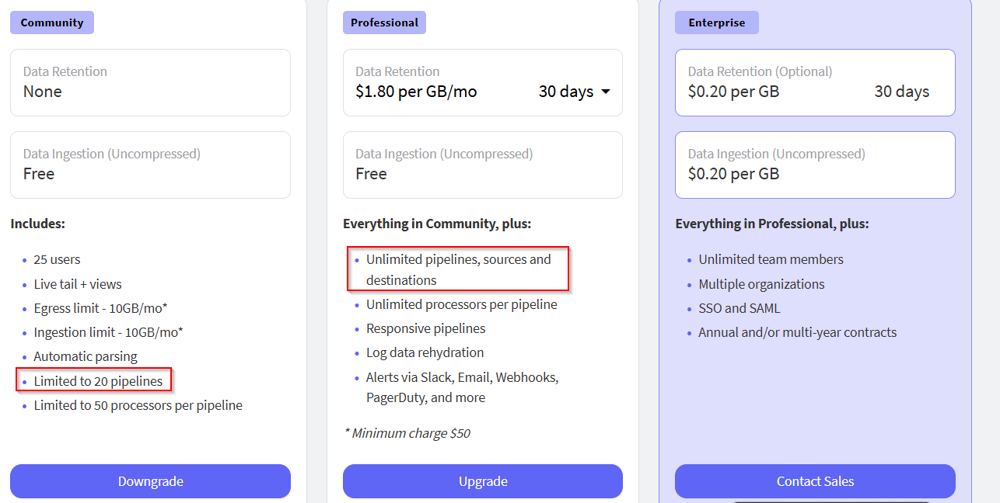
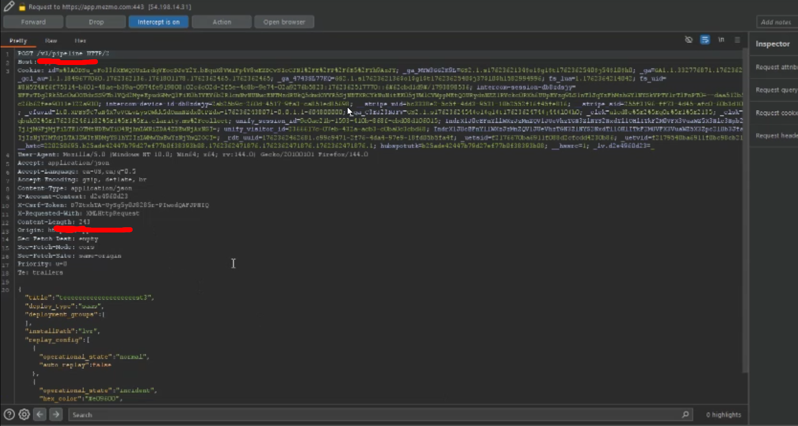
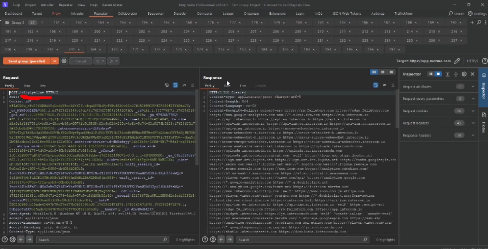
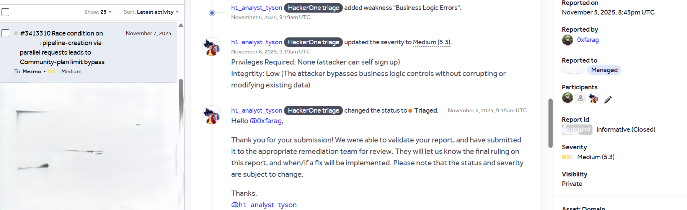
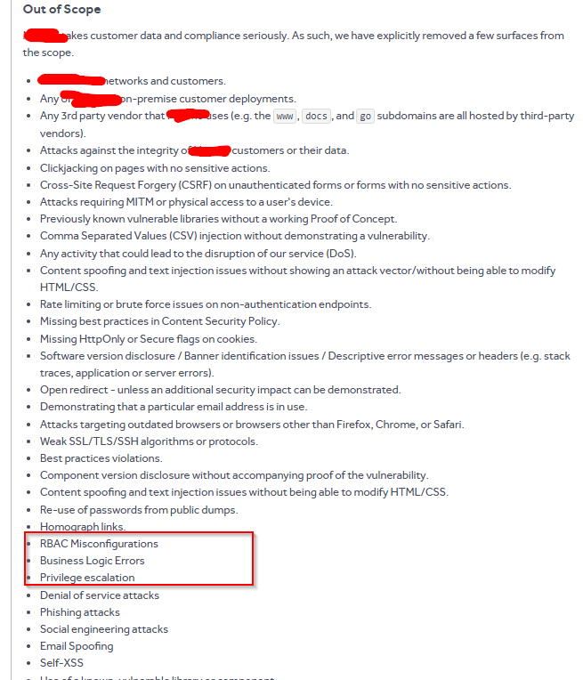

### **السَّلَامُ عَلَيْكُمْ وَرَحْمَةُ اللهِ وَبَرَكَاتُهُ**

This write-up explains how I could bypass the free-plan site limit using race condition  in the pipeline-creation flow allows multiple pipelines to be created concurrently, permitting a Community-plan account to exceed the plan limit and obtain features reserved for higher-tier plans.

## **First: What is a race condition?**

A race condition occurs when the outcome of a process depends on the unpredictable order in which multiple threads or processes access and modify shared resources. This can lead to unexpected and potentially erroneous results, or even security vulnerabilities. Essentially, it’s a “race” to access a resource, and the order in which they arrive determines the outcome.

## Free Plan vs Pro Plan

when you see the policy of free plan you find only have 20 pipelines can create it

we try to use race condition to create more than 20

### Add Pipeline request

send request to repeater and add it to group then duplicate it

## **Impact**

- Bypasses plan restrictions and business logic.
- Allows free users to access paid functionality without authorization.
- Potential platform abuse through the creation of excessive endpoints.

## HackerOne proof

First: HackerOne Triager accept the report and change status to **triage and pending bounty**

But internal team closed my report to info which say the business logic is out of the scope and my report is duplicated to my report (same report id but is lay)

Scope of App

is un predictable which most of logic bugs is out of the scope

